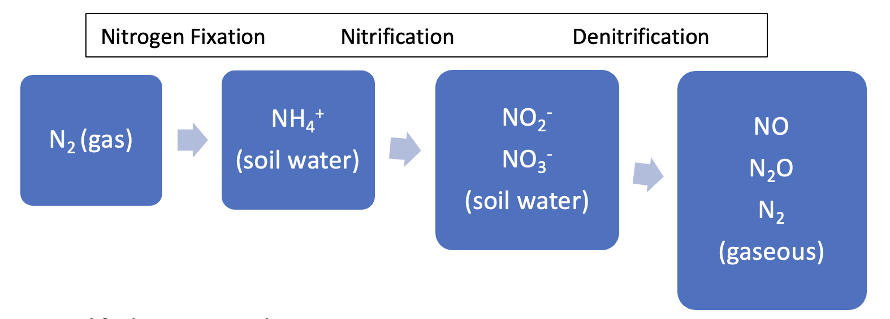
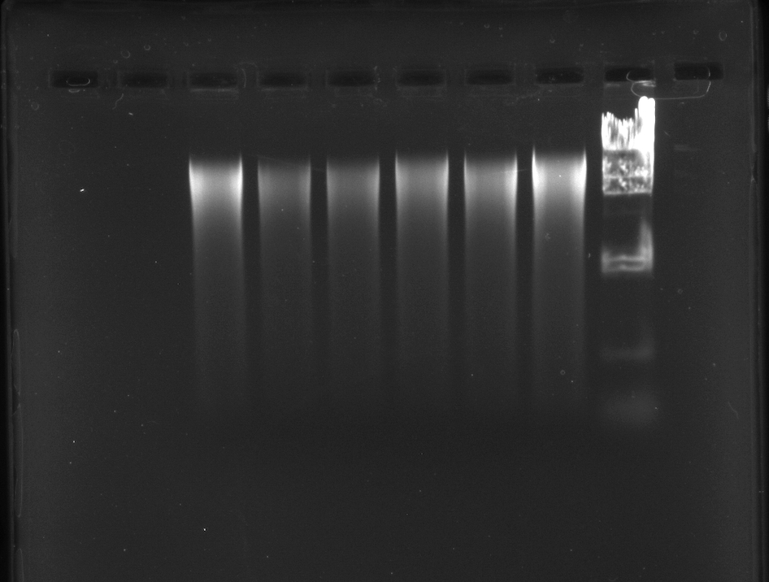
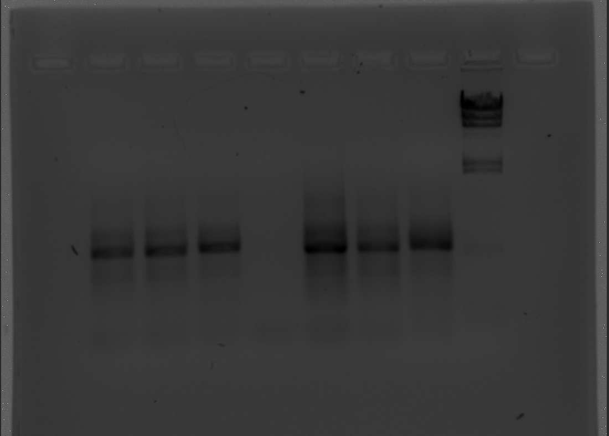
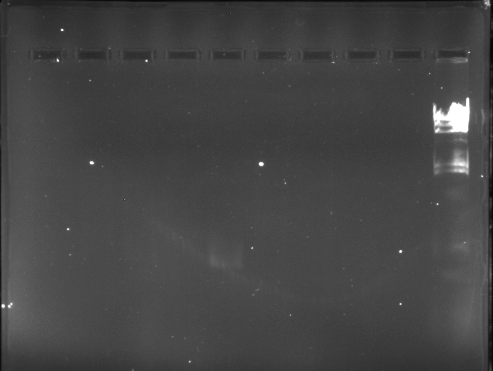
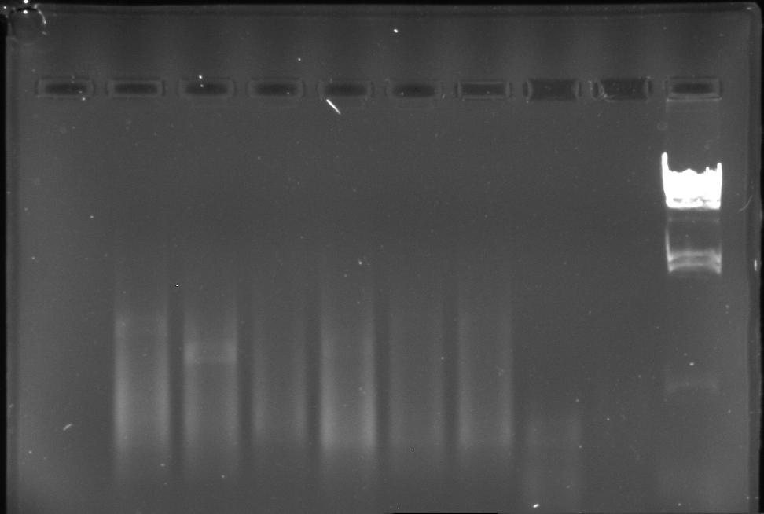
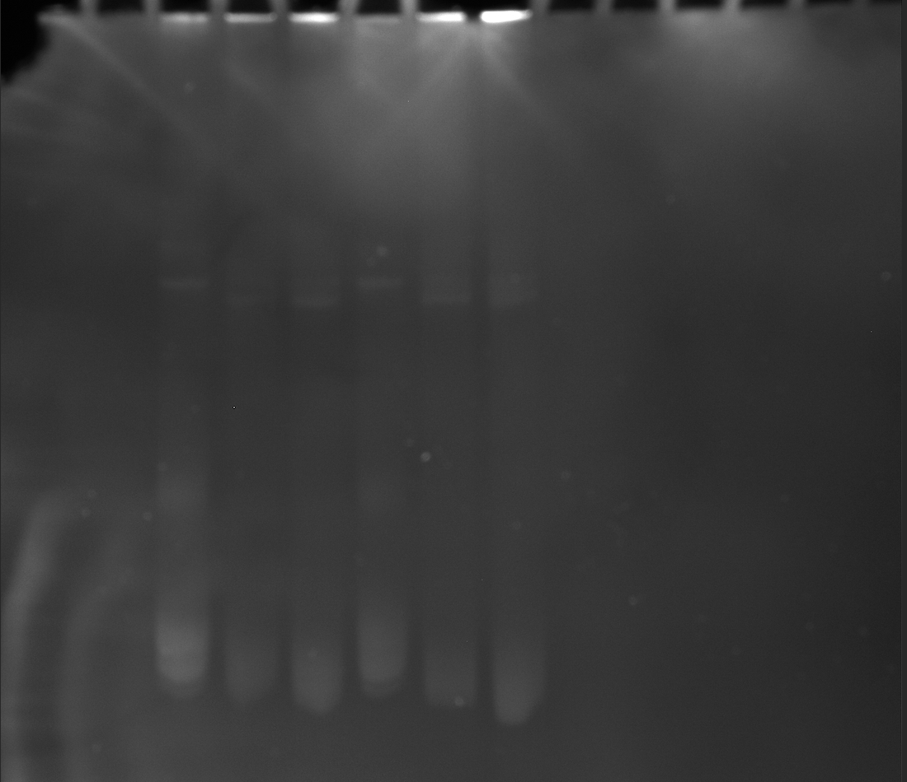

\pagenumbering{roman} <!-- format page numbering -->
\thispagestyle{empty} <!-- format page numbering -->
\newpage <!-- insert new page -->
\vspace*{\fill} <!-- vertically center text -->

## \centering ACKNOWLEDGEMENTS
\doublespacing <!-- change spacing -->
\hfill \linebreak
\hfill \linebreak
I want to thank my thesis adviser Sean O'Connell for the many hours he spent looking over and discussing the work, pushing this project to completion.  To my thesis committee Drs. Beverly Collins, Anjana Sharma, and Greg Adkison for the feedback that helped make this project coherent. To the Western Carolina Biology department for academic support and use of facilities, to Western Carolina University, the Bob Zahner award for Environmental Science committee, the Native Plant Conference scholarship committee for financial support through grants and scholarships.  To Friends of Great Smoky Mountains National Park, without who's funding this project would not have been finished any time soon, and to the Research Coordinator for the park Paul Super, who led us through the woods to our sample sites, helped collect soil samples, and introduced me to the sound of a catbird.  Thank you all!
\vspace*{\fill} <!-- vertically center text -->
\newpage <!-- insert new page -->
\singlespacing <!-- change spacing -->
\renewcommand{\contentsname}{\centering TABLE OF CONTENTS} <!-- center TOC title -->
\tableofcontents <!-- insert table of contents here -->
\listoftables <!-- insert list of tables -->
\listoffigures <!-- insert list of figures -->

```{r, setup, include=FALSE}
knitr::opts_chunk$set(echo = TRUE, out.extra = "", fig.pos = "h", results = "hide")

library(papaja)
library(tidyverse)
library(xfun)
library(FactoMineR)
library(factoextra)
library(vegan)
library(kableExtra)
library(knitr)
library(latex2exp)
library(tinytex)
library(rstatix)
library(forcats)
library(webshot)
library(magick)

papaja::r_refs(file= "Thesis_R_packages.bib") # package bibliography document generation

```

```{r, remove objects, eval=FALSE, include=FALSE, echo=FALSE}
# remove all objects from environment 
rm(list = ls())
# remove an object from environment 
rm(func_legend)
```
```{r, dataprep_bacbar, echo=FALSE, cache=TRUE}
# import data, create data frame
bacterial_data_frame <- read.csv('16S_otu_taxa_table.csv')

# remove extra characters in columns
bac <- bacterial_data_frame[,-15] %>%
  mutate(Kingdom = substr(Kingdom, 4, nchar(Kingdom)),
         Phylum = substr(Phylum, 4, nchar(Phylum)),
         Class = substr(Class, 4, nchar(Class)),
         Order = substr(Order, 4, nchar(Order)),
         Family = substr(Family, 4, nchar(Family)),
         Genus = substr(Genus, 4, nchar(Genus)),
         Species = substr(Species, 4, nchar(Species)))

# replace some deleted characters from previous function
# group "Candidatus" with unclassified
bac$Kingdom <- bac$Kingdom %>% str_replace_all("lassified", "Unclassified")
bac$Genus <- bac$Genus %>% str_replace_all("Candidatus", "Unclassified")
# replace missing/empty characters with NA
bac[bac == ""] <- "Unclassified"
# 13544 reads in all samples (normalized)
# sum all phyla, create object
bacP <- aggregate(.~Phylum, data = bac[,c(-1,-8,-(10:14))],sum)
# sum all genera, create object
bacG <- aggregate(.~Genus, data = bac[,c(-1,-(8:12),-14)],sum)
# checked for correctness: NO
# 1% of site reads
# (13544*.01) = 135.44
# filter out rows if any column contains a value greater than 135 
# these = observations that represent greater than 1% of sample reads
bacPmajor <- bacP %>% filter(if_any(where(is.numeric),~.>135))
bacGmajor <- bacG %>% filter(if_any(where(is.numeric),~.>135))
#filter out rows when any column contains a value lower than 135
# these = observations that represent less than 1% of sample reads
# all observations summed into Minor Contributors Bin
bacPminor <- bacP[,-1] %>% filter(!if_any(where(is.numeric),~.>135)) %>% summarise_all(sum) %>%
  add_column(Phylum = "Minor Contributors", .before = T)
bacGminor <- bacG[,-1] %>% filter(!if_any(where(is.numeric),~.>135)) %>% summarise_all(sum) %>%
  add_column(Genus = "Minor Contributors", .before = T)
# combine minor and major data frames to complete preparation for bar charts
bacPbar <- rbind(bacPmajor, bacPminor) %>% pivot_longer(cols = 2:7, names_to = "Site",
                                                        values_to = "Count")
bacGbar <- rbind(bacGmajor, bacGminor) %>% pivot_longer(cols = 2:7, names_to = "Site",
                                                        values_to = "Count")
# checked for correctness: YES
```
```{r, dataprep_fungbar, echo=FALSE, cache=TRUE}
# import data, create data frame
fungal_data_frame <- read.csv('ITS_otu_taxa_table.csv')

# remove extra characters in columns
fung <- fungal_data_frame %>%
  mutate(Kingdom = substr(Kingdom, 4, nchar(Kingdom)),
         Phylum = substr(Phylum, 4, nchar(Phylum)),
         Class = substr(Class, 4, nchar(Class)),
         Order = substr(Order, 4, nchar(Order)),
         Family = substr(Family, 4, nchar(Family)),
         Genus = substr(Genus, 4, nchar(Genus)),
         Species = substr(Species, 4, nchar(Species)))

# replace some deleted characters from previous function
fung$Kingdom <- fung$Kingdom %>% str_replace_all("lassified", "Unclassified")

# replace missing/empty characters with NA
fung[fung == "" |
       fung == "unidentified"] <- "Unclassified"
# 28667 reads in all samples (normalized)
# sum all phyla, create object
fungP <- aggregate(.~Phylum, data = fung[,c(-1,-8,-(10:14))],sum)
# sum all genera, create object
fungG <- aggregate(.~Genus, data = fung[,c(-1,-(8:12),-14)],sum)
# 1% of site reads
# (28667*.01) = 286.67
# filter out rows if any column contains a value greater than 286 
# these = observations that represent greater than 1% of sample reads
# ALSO, filter out non fungi Phylum "Anthophyta"
fungPmajor <- fungP %>% filter(if_any(where(is.numeric),~.>286), !Phylum == "Anthophyta")
Anthophyta <- filter(fungP, Phylum == "Anthophyta")
fungGmajor <- fungG %>% filter(if_any(where(is.numeric),~.>286))
#filter out rows when any column contains a value lower than 286
# these = observations that represent less than 1% of sample reads
# add Anthophyta to minor contributors 
# all observations summed into Minor Contributors Bin
fungPminor <- fungP[,-1] %>% filter(!if_any(where(is.numeric),~.>286)) %>% 
  rbind(Anthophyta[,-1]) %>% summarise_all(sum) %>%
  add_column(Phylum = "Minor Contributors", .before = T)
fungGminor <- fungG[,-1] %>% filter(!if_any(where(is.numeric),~.>286)) %>% summarise_all(sum) %>%
  add_column(Genus = "Minor Contributors", .before = T)
# combine minor and major data frames to complete preparation for bar charts
fungPbar <- rbind(fungPmajor, fungPminor) %>% pivot_longer(cols = 2:7, names_to = "Site",
                                                        values_to = "Count")
fungGbar <- rbind(fungGmajor, fungGminor) %>% pivot_longer(cols = 2:7, names_to = "Site",
                                                        values_to = "Count")
# checked for correctness: YES
```
```{r, dataprep functional_genes, echo=FALSE, cache=TRUE}
# read functional gene csv file and create data frame
# create row names from column and transpose
# add "replicate" column and add "site" column
genefunc <- read.csv('MIDI_Functional_Genes.csv') %>% 
  column_to_rownames(var= "Measurement..in.cells.g.") %>% t() %>% as.data.frame() %>%
  add_column("Replicate" = c("1","2","3","1","2","3"), .before = T) %>%
  add_column("Site" = c("Cataloochee","Cataloochee","Cataloochee",
                        "Purchase Knob","Purchase Knob","Purchase Knob"), .before = T)
colnames(genefunc)[19] <- "Nitrogn Fixing Bacteria (NIF)"
# rename columns with abbreviated gene for PCA display
genefunc_pca <-  genefunc %>%
  pivot_longer(3:27, names_to = "Gene", values_to = "cells/g") %>%
  mutate(Gene = str_match_all(Gene, "(?<=\\().+?(?=\\))")) %>%
  pivot_wider(names_from = Gene, values_from = "cells/g")
# calculate t-tests and p-values between groups, Benjamin Hochberg adjustment applied to p-values
genefunc_t <- genefunc[,-2] %>% pivot_longer(2:26, names_to = "Gene", values_to = "cells/g")
genefunc_t.test <- genefunc_t %>% group_by(Gene) %>%
  t_test(cells/g ~ Site, var.equal = TRUE, p.adjust.method = "bonferroni",
         conf.level = 0.99, alternative = "two.sided") %>% add_significance()
# *** no significant differences between groups were found for any variable ***
# calculate mean and standard deviation for all numeric columns and place in object
# bind data frames together
func_means <- genefunc %>% group_by(Site) %>% summarise(
  across(where(is.numeric), ~mean(.x, na.rm = TRUE))) %>%
  pivot_longer(cols = 2:26, names_to = "Gene", values_to = "Mean")
func_SD <- genefunc %>% group_by(Site) %>% summarise(
  across(where(is.numeric), ~sd(.x, na.rm = TRUE))) %>%
  pivot_longer(cols = 2:26, names_to = "Gene", values_to = "SD")
func_stat <- cbind(func_means, func_SD[,-c(1:2)]) %>%
  mutate(Gene = str_match_all(Gene, "(?<=\\().+?(?=\\))"))
func_stat$Gene <- as.character(func_stat$Gene)
# turn 0 values into NA, so they will not show up in graphs, or complicate calculations
func_stat$Mean <- ifelse(func_stat$Mean == 0, NA, func_stat$Mean)
func_stat$SD <- ifelse(func_stat$SD == 0, NA, func_stat$SD)
# checked for correctness: YES
```
```{r, Bac-meta-data - count/normalization table, include=FALSE, echo=FALSE, cache=TRUE}
# Left to right - C1, C2, C3, P1, P2, P3
# sequence read counts before normalization
# correction factors to revert normalization
# corrected classified to Genus counts
# sum kingdom data
# correct Archaea counts, form list
# correct unclassified counts, form list
bactotals <- c(87452, 13544, 85750, 95176, 81253, 84772)
bacCorrect <- bactotals/13544
bacGenusCorrect <- c(sum(bac[which(!bac$Genus == "Unclassified"), 2]),
                     sum(bac[which(!bac$Genus == "Unclassified"), 3]),
                     sum(bac[which(!bac$Genus == "Unclassified"), 4]),
                     sum(bac[which(!bac$Genus == "Unclassified"), 5]),
                     sum(bac[which(!bac$Genus == "Unclassified"), 6]),
                     sum(bac[which(!bac$Genus == "Unclassified"), 7]))*bacCorrect
bac_king <- bac[,c(-1,-(9:14))] %>% aggregate(.~Kingdom, sum)
bacArchaeacorrect <- c(12,2,2,4,7,0)*bacCorrect
bacUnclassifiedcorrect <- c(112,3823,131,62,42,49)*bacCorrect
# create data frame for count info, then transpose it
bac_counts <- data.frame("1" = c("Site","C1","C2","C3","P1","P2","P3"),
                         "2" = c("Total Reads", bactotals),
                         "3" = c("Correction Factor", bacCorrect),
                         "4" = c("Archaea", bacArchaeacorrect),
                         "5" = c("Unclassified to Kingdom", bacUnclassifiedcorrect),
                         "6" = c("Classified to Genus", bacGenusCorrect)) %>%
  'colnames<-' (.[1,]) %>% .[-1,] %>% 
  mutate_at(c("Total Reads","Correction Factor","Archaea","Unclassified to Kingdom",
              "Classified to Genus"), as.numeric)
# checked for necessary components: YES
# checked for correctness: YES
```
```{r, Fung-meta-data - count/normalization table, include=FALSE, echo=FALSE, cache=TRUE}
# Left to right - C1, C2, C3, P1, P2, P3
# sequence read counts before normalization
# correction factors to revert normalization
# corrected classified to Genus counts
# sum kingdom data
# correct Archaea counts, form list
# correct unclassified counts, form list
fungtotals <- c(28667, 111933, 114164, 112282, 104421, 113000)
fungCorrect <- fungtotals/28667
fungGenusCorrect <- c(sum(fung[which(!fung$Genus == "Unclassified"), 2]),
                      sum(fung[which(!fung$Genus == "Unclassified"), 3]),
                      sum(fung[which(!fung$Genus == "Unclassified"), 4]),
                      sum(fung[which(!fung$Genus == "Unclassified"), 5]),
                      sum(fung[which(!fung$Genus == "Unclassified"), 6]),
                      sum(fung[which(!fung$Genus == "Unclassified"), 7]))*fungCorrect
fung_king <- fung[,c(-1,-(9:14))] %>% aggregate(.~Kingdom, sum)
fungPlantcorrect <- c(510,532,1724,446,29,22)*fungCorrect
fungunclassifiedcorrect <- c(0,0,5,1,2,6)*fungCorrect
# create data frame for count info, then transpose it
fung_counts <- data.frame("1" = c("Site","C1","C2","C3","P1","P2","P3"),
                          "2" = c("Total Reads", fungtotals),
                          "3" = c("Correction Factor", fungCorrect),
                          "4" = c("Plantae", fungPlantcorrect),
                          "5" = c("Unclassified to Kingdom", fungunclassifiedcorrect),
                          "6" = c("Classified to Genus", fungGenusCorrect)) %>%
  'colnames<-' (.[1,]) %>% .[-1,] %>% mutate_at(c("Total Reads","Correction Factor","Plantae","Unclassified to Kingdom",
              "Classified to Genus"), as.numeric)
# checked for necessary components: YES
# checked for correctness: YES
```
```{r, PCA, echo = FALSE, cache=TRUE}
# create data frame for PCA by removing superfluous columns
# add Sequenced_Region column, fill with 16S
# combine column values to form OTU + 16S 
# changing data orientation
Qbac_PCA_df <- bacterial_data_frame[,-(8:15)] %>%
  add_column(Sequenced_Region = "16S") %>%
  unite(OTU, Sequenced_Region, OTU_ID) %>%
  pivot_longer(cols = c(2:7), names_to = "Site") %>%
  pivot_wider(names_from = 1, values_from = 3)
# add functional gene data for PCA
Qbac_PCA_df <- cbind(Qbac_PCA_df, genefunc_pca[,3:27])
# Run PCA using c1, c2, c3, p1, p2, p3, and store the results in an object
Qbacpca <- PCA(Qbac_PCA_df,
              quali.sup = c(1),
              quanti.sup = c(2396:2420),
              graph = FALSE, 
              scale = TRUE)
# create data frame for PCA by removing superfluous columns
# add Sequenced_Region column, fill with ITS
# combine column values to form OTU + ITS 
# changing data orientation
Qfung_PCA_df <- fungal_data_frame[-(8:14)] %>%
  add_column(Sequenced_Region = "ITS") %>%
  unite(OTU, Sequenced_Region, OTU_ID) %>%
  pivot_longer(cols = c(2:7), names_to = "Site") %>%
  pivot_wider(names_from = 1, values_from = 3)
# add functional gene data for PCA
Qfung_PCA_df <- cbind(Qfung_PCA_df, genefunc_pca[,3:27])
# Run PCA using c1, c2, c3, p1, p2, p3, and store the results in an object
Qfungpca <- PCA(Qfung_PCA_df,
              quali.sup = c(1),
              quanti.sup = c(732:756),
              graph = FALSE, 
              scale = TRUE)
# merge data sets horizontally
combo_df <- cbind(Qbac_PCA_df[,-c(2396:2420)], Qfung_PCA_df[,-c(1,732:756)])
comboPCA_df <- cbind(Qbac_PCA_df[,-c(2396:2420)], Qfung_PCA_df[,-c(1)])
# Run PCA using c1, c2, c3, p1, p2, p3, and store the results in an object
Qcombopca <- PCA(comboPCA_df,
              quali.sup = c(1),
              quanti.sup = c(3126:3150),              # 3126:3150
              graph = FALSE, 
              scale = TRUE)
# checked for correctness: YES
```
```{r, conetPZ, echo=FALSE, message=FALSE, cache=TRUE}
# subtract superfluous columns and add taxa indicator column
conetPZ_bac <- bacterial_data_frame[-c(8, 10:12, 14:15)] %>%
  add_column(Sequenced_Region = "16S")

# subtract superfluous columns and add taxa indicator column
conetPZ_fung <- fungal_data_frame[-c(8,10:12,14)] %>%
  add_column(Sequenced_Region = "ITS")

# combine datasets
# combine taxa identifiers
conetPZ <- full_join(conetPZ_bac, conetPZ_fung) %>%
  unite(OTU_ID, Sequenced_Region, OTU_ID)

# replace missing/empty characters with Unclassified
conetPZ[conetPZ == "" |
          conetPZ == "g__" |
          conetPZ == "g__unidentified" |
          conetPZ == "p__unidentified"] <- "Unclassified"

# calculate relative abundances (proportional) by "OTU count"/"sample count sum"
conetPZ$C1 <- conetPZ$C1/sum(conetPZ$C1)
conetPZ$C2 <- conetPZ$C2/sum(conetPZ$C2)
conetPZ$C3 <- conetPZ$C3/sum(conetPZ$C3)
conetPZ$P1 <- conetPZ$P1/sum(conetPZ$P1)
conetPZ$P2 <- conetPZ$P2/sum(conetPZ$P2)
conetPZ$P3 <- conetPZ$P3/sum(conetPZ$P3)

# sum read proportions and  by Phyla and Genera in each sample
PconetPZ <- conetPZ %>%
  group_by(Phylum) %>%
  summarise(across(c(C1,C2,C3,P1,P2,P3), sum))

GconetPZ <- conetPZ %>%
  group_by(Genus) %>%
  summarise(across(c(C1,C2,C3,P1,P2,P3), sum))
# checked for correctness: YES
```
```{r, conetPZ Pearson correlation matrices, echo=FALSE, cache=TRUE}
# 1st step transposing dataframe
PconetPZcorr_df <- pivot_longer(PconetPZ, cols = 2:7, names_to = "Site") %>%
  pivot_wider(names_from = 1, values_from = 3)
GconetPZcorr_df <- pivot_longer(GconetPZ, cols = 2:7, names_to = "Site") %>%
  pivot_wider(names_from = 1, values_from = 3)
# Phyla correlation matrices
# alpha = .001
Phylacorr.mat <- cor_mat(PconetPZcorr_df[,-1], 
                         method ="pearson",
                         alternative = "two.sided", # alternative hypothesis (reject null):
                         conf.level = 0.99)         # true correlation does not=0
#  Genera correlation matrix
# alpha = .001
Generacorr.mat <- cor_mat(GconetPZcorr_df[,-1],
                          method ="pearson",
                          alternative = "two.sided", # alternative hypothesis (reject null):
                          conf.level = 0.99)         # true correlation does not=0
# checked for correctness: YES
```
```{r, corrp_value, echo=FALSE, warning=FALSE, cache=TRUE}
# extract p-value matrix from correlation matrix
# perform bonferroni correction for multiple hypothesis testing
# tell r to treat as data frame
# change character data to numeric data
# replace empty "rowname" with "rowname" from initial data frame
# change data frame shape
# change column name
# extract p-values that are not self correlations
# extract significant p-values < (alpha=.001)
# non self correlates placed back into a table data frame, in this case all are self correlates
Pcorr_p_val <- cor_get_pval(Phylacorr.mat)
Pcorr_p_adj <- sapply(Pcorr_p_val, p.adjust, method = "bonferroni")
Pcorr_p_adj <- as.data.frame(Pcorr_p_adj)
Pcorr_p_adj <- Pcorr_p_adj %>% mutate_if(is.character, as.numeric)
Pcorr_p_adj[,1] <- paste(Pcorr_p_val$rowname)
Pcorr_p_adj <- pivot_longer(Pcorr_p_adj, cols = 2:36, names_to = "Genus", values_to = "P.adj")
colnames(Pcorr_p_adj)[1] <- "Genus2"
Pcorr_p_adj <- subset(Pcorr_p_adj, !Pcorr_p_adj$Genus2 == Pcorr_p_adj$Genus)
Pcorr_p_adj <- subset(Pcorr_p_adj, P.adj<.001)
# extract p-value matrix from correlation matrix
# perform bonferroni correction for multiple hypothesis testing
# tell r to treat as data frame
# change character data to numeric data
# replace empty "rowname" with "rowname" from initial data frame
# change data frame shape
# change column name
# extract p-values that are not self correlations
# extract significant p-values < (alpha=.001)
# filter out duplicated genera correlations, and P.adj = 0
Gcorr_p_val <- cor_get_pval(Generacorr.mat)
Gcorr_p_adj <- sapply(Gcorr_p_val, p.adjust, method = "bonferroni")
Gcorr_p_adj <- as.data.frame(Gcorr_p_adj)
Gcorr_p_adj <- Gcorr_p_adj %>% mutate_if(is.character, as.numeric)
Gcorr_p_adj[,1] <- paste(Gcorr_p_val$rowname)
Gcorr_p_adj <- pivot_longer(Gcorr_p_adj, cols = 2:175, names_to = "Genus", values_to = "P.adj")
colnames(Gcorr_p_adj)[1] <- "Genus2"
Gcorr_p_adj <- subset(Gcorr_p_adj, !Gcorr_p_adj$Genus2 == Gcorr_p_adj$Genus)
Gcorr_p_adj <- subset(Gcorr_p_adj, P.adj<.001)
Gcorr_p_adj <- Gcorr_p_adj %>% 
  filter(!duplicated(paste0(pmax(Genus2, Genus), pmin(Genus2, Genus)))) %>%
  filter(!P.adj == 0)
# change column name
colnames(Gcorr_p_adj)[1] <- "Genera"
# remove "g__" from character strings
Gcorr_p_adj <- Gcorr_p_adj %>% mutate(Genera = substr(Genera, 4, nchar(Genera)),
                       Genus = substr(Genus, 4, nchar(Genus)))
# change column name
colnames(Gcorr_p_adj)[c(1,2)] <- "Genus"
# checked for correctness: YES
```
```{r, dataprep_nematable, echo=FALSE, cache=TRUE}
# import data and create data frame
# remove empty columns and add column
# place character strings within rows in new column
# rename columns and remove empty rows
# replace values below detection with 0
nematodedata <- read.csv('Nematodes_R/Nematodes_Elin_Samples.csv')
nematodedata <- nematodedata[,-c(9,10)] %>% 
  rowid_to_column(var = "Trophism")
nematodedata[c(3:13),1] <- "Bacterivorous"
nematodedata[c(16:21),1] <- "Fungivorous"
nematodedata[c(24:43),1] <- "Herbivorous"
nematodedata[c(46:50),1] <- "Other"
nematodedata[c(53:63),1] <- "Omnivorous"
colnames(nematodedata) <- c("Trophism", "Species", "Component", 
                                           "C1","C2","C3","P1","P2","P3")
nematodedata <- nematodedata[-c(1,14,22,44,51,64,65),] 
# save this -c(1,2,14,15,22,23,44,45,51,52,64,65)
nematodedata[grep("<", nematodedata$C1), "C1"] <- "0"
nematodedata[grep("<", nematodedata$C2), "C2"] <- "0"
nematodedata[grep("<", nematodedata$C3), "C3"] <- "0"
nematodedata[grep("<", nematodedata$P1), "P1"] <- "0"
nematodedata[grep("<", nematodedata$P2), "P2"] <- "0"
nematodedata[grep("<", nematodedata$P3), "P3"] <- "0"
nematodedata <- nematodedata %>% filter(!if_all(c(C1,C2,C3,P1,P2,P3),
                                                          ~ .x == "0"))
nematodedata[1,3] <- ""
nematodedata <- nematodedata[,-1]
nematodedataC <- nematodedata[,1:5]
nematodedataP <- nematodedata[,c(1,2,6:8)]
# Legend: NA = Not Analyzed; NS = Not Sampled; J = Estimated gene copies below practical quantitation level (PQL) but above laboratory quantitation level (LQL); I = Inhibited; < = Result not detected
# checked for correctness: Yes
```
```{r, dataprepalphadiversity, echo=FALSE, cache=TRUE}
# richness - number of observed species in a community, 
# chao1 - non-parametric estimate of number species in a community,
# ACE - non-parametric estimate of number species in a community using sample coverage,
# sample coverage = sum of probabilities of observed species
# calculate richness, chao1, ACE and standard errors
richness <- estimateR(combo_df[,-1])
# calculate Pielous evenness - relative abundance of observed species
evenness <- diversity(combo_df[,-1])/log(specnumber(combo_df[,-1]))
# calculate Shannon's H diversity - measure of richness and evenness
# weighting richness more than evenness
shannonH <- diversity(combo_df[,-1], index = "shannon")
# calculate Simpsons diversity - measure of richness and evenness
# weighting evenness more than richness
simpsons <- diversity(combo_df[,-1], index = "simpson")
# data subset for goods coverage 
singletons <- pivot_longer(combo_df, cols = 2:3125, names_to = "OTU") %>% 
  subset(value < 10)
singlesums <- cbind(sum(singletons$Site == "C1"),  # singletons summed by site and bound to list
      sum(singletons$Site == "C2"),
      sum(singletons$Site == "C3"),
      sum(singletons$Site == "P1"),
      sum(singletons$Site == "P2"),
      sum(singletons$Site == "P3"))
# calculate sum of all reads
fullsum <- sum(combo_df[,-1])
# goods coverage = 1-(singletons/sum all reads)
# singletons = low abundance OTUs
goodcoverage <- 1-(singlesums/fullsum)
# create object, a table of indices
alphadiversity <- rbind(richness, evenness, shannonH, simpsons, goodcoverage)
# change row names
rownames(alphadiversity) <- c("Species Observed", "Chao1", "Std.Error Chao1", "ACE", "Std.Error ACE", "Pielou's Evenness", "Shannon H", "Simpson's", "Good's Coverage")
# change column names
colnames(alphadiversity) <- c("C1", "C2", "C3", "P1", "P2", "P3")
# transpose table
alphadiversity <- t(alphadiversity)
# Checked for correctness: YES
```


\newpage <!-- insert new page -->
\pagenumbering{arabic} <!-- format page numbering -->
\doublespacing <!-- change spacing -->

## \centering ABSTRACT
\hfill \linebreak
\noindent MICROBIAL COMMUNITIES AS INDICATORS OF ECOSYSTEM FUNCTIONS AT TWO SITES IN GREAT SMOKY MOUNTAINS NATIONAL PARK  
Elin Richard Swank, M.S. Biology  
Western Carolina University (Month of Defense)  
Director: Dr. Sean O'Connell  
\hfill \linebreak
\hfill \linebreak
\noindent  Differences in soil nutrient cycling, including nitrogen cycling, and bio-availability have been linked to the inhabiting microbial and plant community interactions (Powell et al., 2015; Levy-Booth et al., 2014).  Understanding the community relationships and their effects may help us describe the role of the microbiome in influencing plant communities and ecosystem functions [@phillipsMycorrhizalassociatedNutrientEconomy2013; @isobeNitrificationNitrifyingMicrobial2011; @hacquardHolisticUnderstandingBeneficial2015].  Data quality and quantity is needed to describe causal relationships between microbial communities, plant communities, and their distributions in an ecosystem [@mushinskiForestHarvestIntensity2017]. To address the need for and demonstrate the utility of, functional and process focused data, microbial community analysis was conducted focusing on known bacterial nitrogen cyclers and mycorrhizal fungi.  Samples were cored from the mineral soil within the mycorrhizosphere surrounding a Northern Red Oak at both the Purchase Knob and Cataloochee All Taxa Biodiversity Inventory (ATBI) plots (n=12 from each site).  Samples were pooled and homogenized by sub site location around the Oak tree at each site (up slope, side slope, down slope; n=3 from each site).  DNA extraction and next generation sequencing of the bacterial 16S rRNA and fungal internal transcribed spacer (ITS) rRNA regions were performed by Azenta, Inc. (South Plainfield, NJ).  Important bacterial genera found include the metabolically diverse *Burkholderia*, as well as known participants in soil nitrogen cycling *Nitrospira*, *Bradyrhizobium*, *Rhodoplanes*, and *Pedomicrobium*.  Ectomycorrhizal fungi genera that are important plant symbiotes and transporters of nutrients within soil [@allenECOLOGYMYCORRHIZAEConceptual2003; @churchlandSpecificityPlantmicrobeInteractions2014] were found, including *Sebacina*, *Russula*, *Elaphomyces* and the potentially ectomycorrhizal *Pseudotricholoma*.  Principal components analysis (PCA) of the distributions of sequences showed a clear difference between the Cataloochee and Purchase Knob sites with greater variability in community composition at Cataloochee for both bacteria and fungi.  Key and prevalent groups identified are known to be involved in nitrogen cycling, plant associations, and nutrient transport suggesting that their relationships play some role in biogeochemical and nutrient cycling.  Future analyses are needed to describe the pathways between microbial and plant, taxa and communities, and the emergent properties relating them to nutrient cycling and ecosystem functions. 
\newpage <!-- insert new page -->

## \centering BACKGROUND
\hfill \linebreak
### \centering NITROGEN CYCLING AND CLIMATE CHANGE
\hfill \linebreak
Climate change is significantly altering earth’s biogeochemical cycles which is affecting ecosystem functions in poorly understood ways.  Nitrogen (N) cycling is composed of three main steps where initial atmospheric dinitrogen (N~2~) gas is deposited in soil as ammonium (NH~4~^+^) through the process of nitrogen fixation.  Subsequent transformation of NH~4~^+^ via nitrification into nitrite (NO~2~^-^) and nitrate (NO~3~^-^) allows for the third chemical transformation.  Denitrification is the final process from which nitrous and nitric oxides (N~2~O and NO respectively), and ultimately N~2~ can be produced and released into the atmosphere [@levy-boothMicrobialFunctionalGenes2014].  N cycling is predominantly mediated by microbes in the soil, with individual processes largely performed by specialized taxonomic groups [@isobeNitrificationNitrifyingMicrobial2011].  Soil nitrogen cycling is displayed in a simplified form in Figure \@ref(fig:Ncycle).  Soil nitrification begins with bacterial and archaeal oxidation of ammonia into nitrate using the ammonia monooxygenase (amo) enzyme, encoded partially by *amoA* genes [@horzAmmoniaoxidizingBacteriaRespond2004; @levy-boothMicrobialFunctionalGenes2014].  The amo enzyme catalyzes the rate limiting step of ammonia oxidation, which itself is the rate limiting step in nitrification, a process that is essential for increasing N bioavailability in N limited ecosystems [@horzAmmoniaoxidizingBacteriaRespond2004; @isobeNitrificationNitrifyingMicrobial2011; @levy-boothMicrobialFunctionalGenes2014; @normanSubstrateNutrientLimitation2014].  NH~4~^+^ and NO~3~^-^ are the main forms by which living organisms obtain N from soil [@isobeNitrificationNitrifyingMicrobial2011; @levy-boothMicrobialFunctionalGenes2014].  Nitrification and denitrification dictate N availability and loss in terrestrial systems where N limitations are common [@levy-boothMicrobialFunctionalGenes2014; @mushinskiForestHarvestIntensity2017].  Nitrification losses occur when NO~3~^-^ leaches through the soil solution, reducing groundwater and stream quality, causing soil acidification and habitat eutrophication in systems importing the leachate [@isobeNitrificationNitrifyingMicrobial2011; @lavermanSpatiotemporalStabilityAmmoniaoxidizing2001; @levy-boothMicrobialFunctionalGenes2014].  Denitrification losses occur through emission of N~2~O and NO gases into the atmosphere, contributing to global climate change by trapping heat, where N~2~O has shown to be many times more potent than carbon dioxide over a 100-year period, and has also been linked to ozone depletion [@horzAmmoniaoxidizingBacteriaRespond2004; @isobeNitrificationNitrifyingMicrobial2011; @levy-boothMicrobialFunctionalGenes2014].  Increased N compound leaching and emission from forested systems, predominantly through NO and N~2~O dissolution into water is largely attributed to increasing N deposition on the system which is caused by industrial processes and fossil fuel combustion [@aberFactorsControllingNitrogen1991; @gallowayNitrogenCascade2003; @isobeNitrificationNitrifyingMicrobial2011]. Increased N deposition likely alters soil microbiomes through changes in microbial community structure and function, as well as N cycling [@horzAmmoniaoxidizingBacteriaRespond2004; @isobeNitrificationNitrifyingMicrobial2011].  Microbial communities may be a mitigating factor regarding climate change, shifting of ecosystems and functions, and may be utilized for forest conservation management purposes if better understood.
```{r, Ncycle, fig.cap='Simplified Nitrogen Cycle', fig.align='center', out.width='100%', echo=FALSE, results='asis', cache=TRUE}

```

### \centering OAK SIGNIFICANCE
\hfill \linebreak
It is likely that plants alter microbiomes in the soil they inhabit, and it is thought that the microbial communities within affect the health and fitness of the plant [@hacquardHolisticUnderstandingBeneficial2015; @pinhoLinkingTreeHealth2020].  The oak genus, *Quercus*, is regarded as a highly ecologically and economically valuable contributor to eastern U.S. forested ecosystems [@conradThreatsOaksEastern2020; @radcliffePredisposingFactorsEffects2021].  Some Oaks are considered keystone species because of their contributions to wildlife food supplies through acorn production, and leaf hosting of highly abundant and diverse insect taxa [@greenbergForecastingLongTermAcorn2014; @radcliffePredisposingFactorsEffects2021].  In this regard oak species diversity may also mitigate food supply shortages through differences in “red” vs “white” subgenus acorn production cycles, and especially after a major frost where acorn production losses are differentially timed between subgenera [@radcliffePredisposingFactorsEffects2021].  The oak decline phenomenon, which consists of a complex suite of abiotic and biotic factors whose relationships are little understood, is affecting many oak-dominated forests [@conradThreatsOaksEastern2020; @radcliffePredisposingFactorsEffects2021].  Oak replacement by shade-tolerant mesophytic tree species, and oak regeneration failure have also been observed in several study areas [@radcliffePredisposingFactorsEffects2021].  The relationships between soil microbes and plant cohorts may be intrinsic to these phenomena and represent a gap in scientific understanding that could benefit from increased attention.

### \centering MYCORRHIZAL FUNGI
\hfill \linebreak
Understanding plant-microbe interactions can elucidate the effects of microbiomes on plant lifestyles and lifecycles [@hacquardHolisticUnderstandingBeneficial2015].  These interactions have also been linked to differences in nutrient cycling and availability [@phillipsMycorrhizalassociatedNutrientEconomy2013; @isobeNitrificationNitrifyingMicrobial2011].  Recent studies have indicated the importance of soil microbiomes in plant health, especially within the rhizosphere [@hacquardHolisticUnderstandingBeneficial2015; @pinhoLinkingTreeHealth2020].  Mycorrhizal fungi are ubiquitous, contribute to plant growth and nutrient cycling, and have shown to organize around plant functional type [@allenECOLOGYMYCORRHIZAEConceptual2003; @phillipsMycorrhizalassociatedNutrientEconomy2013; @churchlandSpecificityPlantmicrobeInteractions2014; @terrerMycorrhizalAssociationPrimary2016].  Arbuscular and ectomycorrhizal (AM and EM respectively) fungi are likely associated with most tree species in temperate forests and reflect differences in biogeochemical processes between them [@phillipsMycorrhizalassociatedNutrientEconomy2013].  AM associated plants tend to have faster decomposing litter and require AM to scavenge soil for nutrients, unlike EM associates that can extract nutrients from organic matter and whose litter tends to decompose more slowly [@phillipsMycorrhizalassociatedNutrientEconomy2013; @readMycorrhizasNutrientCycling2003].  @phillipsMycorrhizalassociatedNutrientEconomy2013 found that EM associated trees were well correlated to the ratio of organic N to inorganic N in the upper surface soil and increasing percentages of AM associated trees were correlated to increased N losses in a system.  Nutrient cycling and bacterial communities have been linked to processes involving mycorrhizae; this is especially so in soil around the mycorrhizal root system, termed the mycorrhizosphere [@allenECOLOGYMYCORRHIZAEConceptual2003; @phillipsMycorrhizalassociatedNutrientEconomy2013; @churchlandSpecificityPlantmicrobeInteractions2014; @terrerMycorrhizalAssociationPrimary2016].

### \centering MICROBIAL COMMUNITIES AND ECOSYSTEM FUNCTIONS
\hfill \linebreak
Microbial community data is generally regarded as noisy (containing complex background information that can make it hard to interpret trends), sparse (many observations are zero counts), and compositional (community composition is derived from interactions of the individuals) [@busatoCompositionalitySparsitySpurious2023; @weissCorrelationDetectionStrategies2016].  These factors make microbial community correlation analysis difficult and lead to loss of aspect specificity in any particular interaction, especially when more than two aspects of a community are involved [@busatoCompositionalitySparsitySpurious2023; @weissCorrelationDetectionStrategies2016].  Although there has been little progress in relating microbial communities to in situ ecosystem biogeochemical functioning, this is being remedied with advanced molecular techniques and modeling [@grahamMicrobesEnginesEcosystem2016; @isobeNitrificationNitrifyingMicrobial2011; @powellMicrobialFunctionalDiversity2015].  Microbial gene abundance has been correlated with changes in process rates, and soil characteristics when using quantitative analysis to analyze functional gene sequences [@levy-boothMicrobialFunctionalGenes2014].  Also, statistical models have shown to be more accurate and predictive of ecosystem function and soil characteristics when incorporating microbial functional genes [@grahamMicrobesEnginesEcosystem2016; @powellMicrobialFunctionalDiversity2015].  The spatial patterns of functional communities in soil likely play an important role in determining where specific functions take place and may indicate a spatially specific ability to mitigate changing environmental conditions.  Ubiquity and complexity of microorganisms in the soil may preclude the direct application of studies regarding them into issues of resource or conservation management.  Finer details may need to be resolved for specific issues and environments, especially when scaling up to the ecosystem level.  But these qualities also may present a background on which issues in these areas become apparent or understood more clearly, such as understanding the mycorrhizae plant complex's influence on the distribution of biogeochemically functional microbes within an ecosystem.  Knowing how these complex species associations interact in their environment may give us a way to isolate functional species within an ecosystem to a specific niche, allowing us to derive a spatially explicit map of ecosystem functions.

## \centering INTRODUCTION
\hfill \linebreak
It is known that plants, microbes (including fungi), and soil abiotic factors act on one another dynamically, but the spatial patterns and mechanisms are not always well understood [@horzAmmoniaoxidizingBacteriaRespond2004; @mushinskiForestHarvestIntensity2017; @normanSubstrateNutrientLimitation2014]. Because it is logistically difficult, time consuming, and expensive to probe and analyze soil microbial communities, there is a shortage of research in this area regarding spatial distribution and functional gene assemblages within soils or across landscapes [@levy-boothMicrobialFunctionalGenes2014; @mushinskiForestHarvestIntensity2017].  The inability to culture many soil bacteria in laboratories likely leads to reservations when deciding on research to be funded and this contributes to a lack of microbial species resolution regarding what species are present and their function in the soil environment, [@horzAmmoniaoxidizingBacteriaRespond2004; @mushinskiForestHarvestIntensity2017].  To establish causal relationships there is a need for data quantity and quality regarding soil microbial communities and their spatial distribution in ecosystems [@mushinskiForestHarvestIntensity2017].  Spatial information of these communities allows us to know where they are in soil environments, and when combined with measures of abundance and functional genes, can indicate the ecological importance of what they do in situ.  Ammonia oxidation is a critical process in the global nitrogen cycle while mycorrhizal fungi dominate nutrient exchange in forested soil environments and oak species are both economically and ecologically important in their environmental range.  The purpose of this research was to investigate the microbial communities within the mycorrhizosphere of Northern Red Oak (*Q. rubra*) in southeastern U.S. hardwood forests of the Appalachian Mountains.

## \centering METHODS
\hfill \linebreak
Samples were taken at the historic Cataloochee and Purchase Knob ATBI (All Taxa Biodiversity Inventory) sites within Great Smoky Mountains National Park on May 12, 2022 with the help of Paul Super and Sean O'Connell.  At each site a mature Northern Red Oak tree was chosen as the sample area from which mineral soil samples would be taken by coring.  Four replicates each were gathered from up slope, cross slope and down slope of the main stem for a total of 24 samples; 12 from each site. After removing leaf litter and humus to expose bare soil, samples were taken by using a soil corer to a depth of approximately 12-18 inches.  Approximately 75 grams were collected from the lower portion of the corer into WhirlPak bags and flash frozen on dry ice in a cooler.  Samples were stored in a -80$^\circ$C freezer on Western Carolina University's campus.

DNA was extracted using the Qiagen DNeasy&reg; Powersoil&reg; Pro Kit. Following the quick start protocol (May 2019) we substituted step 2 with 30 seconds at 2,500 rpm in a bead beater, then 1 minute on ice, followed by another 30 second bead beating. This was done because the vortex adapter referenced in step 2 has been implicated in the extreme shearing of DNA.  DNA extractions were completed June 27, 2022 and stored at -20$^\circ$C.  Agarose gel electrophoresis was performed to test DNA quantity and quality, and polymerase chain reaction (PCR) was performed following to amplify bacterial and Fungal DNA. 

Initial primers used include 341F (forward) with a GC clamp and 907R (reverse) for bacterial 16S rRNA region [@lavermanSpatiotemporalStabilityAmmoniaoxidizing2001; @zhalninaGenomeSequenceCandidatus2014; @ribbonsLinkingMicrobialCommunities2016; @pinhoLinkingTreeHealth2020], EF4 (forward) and ITS4R (reverse) for the first reaction of a nested PCR method for fungi, ITS1F (forward) with a GC clamp and ITS2R (reverse) for the second reaction[@selosseBasalHymenomycetesBelonging2002; @nguyenBasidioascusGeminibasidiumNew2013; @ribbonsLinkingMicrobialCommunities2016; @pinhoLinkingTreeHealth2020].  To investigate the presence of the *amoA* sub-unit among bacteria and *amoA* gene among archaea in our samples, primers used included *amoA*1F (forward) and *amoA*2R (reverse) for the bacterial *amoA* sub-unit, and amo111F (forward) and amo643R (reverse) for the archaeal *amoA* gene [@dillowDIVERSITYPATTERNS16S2009].  All PCR products were stored at 4$^\circ$C and tested by agarose gel electrophoresis for quality and quantity.  Gel images are displayed below in Figures 2-6.

Originally, we had planned to use denaturing gradient gel electrophoresis (DGGE) to separate PCR products for community diversity analysis and use resultant bands to obtain DNA sequences identifying the bacterial and fungal species present.  Test runs of DGGE were performed using the BioRad D-Code&trade; Universal Mutation Detection System.  While testing the DGGE process it was found that the chemicals and equipment used could not produce the results required for this project.  This irreproducibility led to discarding DGGE in favor of another data collection method.  An opportunity for next generation sequencing was found and the remaining soil samples, which had been preserved at -20$^\circ$C due to a malfunction in the ultralow freezer, were combined into 6 total samples, 3 from each site, 1 each from up slope, side slope, and down slope.  Approximately 1g of soil was sent to GENEWIZ of Azenta Life Sciences (South Plainfield, NJ) for sequencing and initial statistical analysis.  The processes, methods and reports generated by Azenta are included as appendices to this thesis and Raw sequence files will be uploaded to GenBank for access.

The Western Carolina University (WCU) Fall 2022 semester Principles of Microbiology lab (Biol 413/513) taught by Dr. Sean O'Connell used approximately 4 grams of soil from each of the 6 homogenized samples in lab activities.  The soil samples were diluted and suspended in solution and the solution was then plated onto reasoners second agar.  Thirty-three colonies were isolated to a single species and metabolic capabilities along with microscopic features were tested.  The isolated colonies were sent to GENEWIZ of Azenta Life Sciences for sequencing of the 16s rRNA gene and sequence results were analyzed in the Ribosomal Database Project (RDP) to classify the organism [@dunbarEmpiricalTheoreticalBacterial2002].  Sequence results were also submitted to the National Center for Biotechnology Information (NCBI) Basic Local Alignment Search Tool (BLAST) to find the closest relatives to each organism.  Sequences for the isolates will be uploaded to GenBank for access.

### \centering STATISTICS, VISUALIZATIONS AND REPORT GENERATION
\hfill \linebreak
Amplicons from next generation sequencing of bacteria and fungi were grouped into phyla and genera for further analysis.  Bacterial data were subset to individuals (Phyla, Genera) with greater than 100 reads for the construction of stacked bar charts.  Fungal phyla were not subset for stacked bar chart construction, but fungal genera were found to be the most diverse at lower sequence read values.  With many unknown fungal genera leading to increased background noise and making read proportions difficult to interpret.  To make the predominant fungal genera more apparent, only genera with sequence reads greater than 1000 were used in stacked bar chart construction.

Next generation sequencing data analysis and stacked bar chart generation were done in R studio [@R-base] utilizing embedded packages and functions from the tidyverse package [@R-tidyverse].  Shannon and Simpsons diversity indices were created using the vegan package [@R-vegan] and displayed using functions from the tidyverse package.  Correlation matrices and analyses were constructed and performed using recommended analysis techniques and thresholds (Alpha = .001) from [@busatoCompositionalitySparsitySpurious2023; @weissCorrelationDetectionStrategies2016].  Phyla and genera two-sided Pearson correlation (Confidence Interval = .99) matrix construction, analyses and p-value extraction was done using functions from the rstatix package [@-Rstatix].  Principal components analysis (PCA) calculations and visualizations were performed in R-Studio using the FactoMineR [@R-FactoMineR], factoextra [@R-factoextra], and tidyverse [@R-tidyverse] packages.   PDF document generation was done in R_Studio as well, utilizing the the knitr [@R-knitr], latex2exp [@R-latex2exp], and tinytex [@R-tinytex] packages.  R-Studio package bibliography document generation was done using the papaja package [@R-papaja].  The .Rmd file with all code used to produce this report is included as appendices to this thesis.

## \centering RESULTS
\hfill \linebreak
Figures (\@ref(fig:agarosegel1), \@ref(fig:agarosegel2), \@ref(fig:agarosegel3), \@ref(fig:agarosegel4), \@ref(fig:agarosegel5)) display the agarose gel electrophoresis and DGGE test results of genomic DNA and targeted PCR products.  Figure \@ref(fig:agarosegel1) shows smeared bands indicating the presence of genomic DNA in all samples but does not show control groups.  Figure \@ref(fig:agarosegel2) shows smeared bands indicating the success of our PCR protocol on bacterial 16S rRNA.  Figure \@ref(fig:agarosegel3) shows a single visible but smeared band in the Cattaloochee down slope lane suggesting the presence of some bacterial species containing the *amoA* subunit in the sample, but the positive controls did not show amplification.  Figure \@ref(fig:agarosegel4) shows visible smeared bands in all sample lanes and a faint smeared band in the positive control, with nothing apparent in the negative control, indicating that all samples contained some archaea with the *amoA* gene.  Figure \@ref(fig:agarosegel5) shows the DGGE test displaying 16S rRNA PCR products in all sample lanes each with few and unresolved bands insufficient for further analyses.

```{r, agarosegel1, fig.cap="Agarose Gel Results: Bacterial Genomic DNA (DNA ladder far right)", fig.show = "hold", out.width = "50%", echo=FALSE, results='asis', cache=TRUE}

```
```{r, agarosegel2, fig.cap="Agarose Gel Results: Bacterial 16S rRNA PCR products (DNA ladder far left)", fig.show = "hold", out.width = "50%", echo=FALSE, results='asis', cache=TRUE}

```
```{r, agarosegel3, fig.cap="Agarose Gel Results: Bacterial amoA gene PCR products (DNA ladder far right)", fig.show = "hold", out.width = "50%", echo=FALSE, results='asis', cache=TRUE}

```
```{r, agarosegel4, fig.cap="Agarose Gel Results: Archaeal amo gene PCR products (DNA ladder far right)", fig.show = "hold", out.width = "50%", echo=FALSE, results='asis', cache=TRUE}

```
```{r, agarosegel5, fig.cap="Denaturing Gradient Gel Results: Bacterial 16S rRNA PCR products (No DNA ladder)", fig.show = "hold", out.width = "50%", echo=FALSE, results='asis', cache=TRUE}

```

Figures \@ref(fig:stackbarBP), \@ref(fig:stackbarFP), \@ref(fig:stackbarBG) and  \@ref(fig:stackbarFG) , display the proportion of sequence reads from each sample that correspond with the known phyla or genera of each sequence encountered.  Figure \@ref(fig:stackbarBP) shows that at both the Cataloochee and Purchase Knob sites, the two most predominant bacterial phyla were Acidobacteria and Proteobacteria, each accounting for approximately 25-50% of sequence reads in all samples.  The next most relatively abundant phyla found were Actinobacteria, AD3, Chloroflexi and Nitrospirae, which when combined encompass approximately 25% of sequence reads in each sample.  Acidobacteria were found most predominant at Cataloochee down slope (C3) of the site tree, while Proteobacteria were predominant at Cataloochee on the side slope (C2).

The largest proportions of Actinobacteria, AD3, and Chloroflexi were found at Purchase Knob down slope (P3) of the site tree with each AD3 and Chloroflexi almost double the proportion found up slope at Purchase Knob (P1).  Nitrospirae were found in similar proportions in all samples, defining an estimated 1-5% of total sequence reads in each sample.  The data displayed in Figure \@ref(fig:stackbarFP), show the largest proportions of fungal phyla sequence reads were from the Ascomycota, Basidiomycota, and Mucoromycota phyla.  Mucoromycota were found in the highest relative abundance at Cataloochee up slope (C1), and side slope(C2) of the site tree, accounting for an estimated 70% and 37% of total sequence reads in each site respectively.  The largest proportions of Basidiomycota were found in the Purchase Knob up slope (P1), and down slope(P3) samples, accounting for an estimated 61-63% of total sequence reads in each.  Ascomycota accounted for the largest proportion of sequence reads in the Purchase Knob side slope (P2) sample at around 52%.

Figure \@ref(fig:stackbarBG), shows that of the known bacterial genera sequences discovered with sequence counts greater than 100, *Bradyrhizobium* and *Rhodoplanes* were the most abundant in all six samples.  *Bradyrhizobium* and *Rhodoplanes* were found to encompass together, roughly 75% of total sequence reads in all samples with *Rhodoplanes* representing the largest proportion of the two genera.  On the right in Figure \@ref(fig:stackbarFG), we can see that the fungal genera sequenced were considerably more different across sites and slope position than bacterial genera, with some genera only being found in one or two samples.  Site C1 is characterized almost completely by a single genera *Mucor* accounting for roughly 80% of total reads, with *Elaphomyces* as the only other visually discernible genera.  At C2, *Mucor* and *Pseudotricholoma* were found at roughly 50% each with *Mucor* only slightly more predominant.  Site C3 contained predominantly *Russula* and *Geminibasidium*, accounting for approximately 50% and 30% of sequence reads respectively.  Site P1 contained *Astreus*, *Elaphomyces* and *Lactarius* at approximately 6%, 13% and 17% respectively, as well as *Saitozyma*, *Geminibasidium*, and *Sebacina* that encompass roughly 25%, 19%, and 21% respectively.  Site P2 contained the only high proportion of *Sagenomella* sequence reads at roughly 20%, and a small proportion of *Leohumicola* (~9%).  At site P3 we see the largest proportion of *Russula* (~60%) as well as some *Sebacina* (~22%), *Saitozyma* (~8%), and *Leohmicola* (~11%).

Alpha diversity measures are shown in table \@ref(tab:alphadiversitytable) along with a count of species observed, and the goods coverage calculation for each sample.  The goods coverage value reflects the probability that the sequence library included the sequences found in the sample, and higher values indicate lower probability that sequences were not covered in the library.  The goods coverage value for each sample suggests that there is a low probability that the sequences found were not covered in the library used to match sequences.  Chao1 and ACE are abundance based species richness estimates, estimating the actual number of species present within each community sample.  Both ACE and Chao1 indices for all sites estimate similar numbers of species, and the standard error ranges overlap one another lending increased confidence to the estimates.

Pielou's evenness is a calculation of species abundance and diversity indicating the relative abundance of each species in the sample.  Pielou's evenness approaches one when all species observed occur in similar abundances and approaches zero when species abundances vary wildly from one another.  The Pielou's evenness values are .50 and greater suggesting moderate community evenness in all samples, with increased evenness in the Purchase Knob samples (.65), and the highest community evenness seen in sample C3 (.74).  Shannon H and Simpson's indices are indicators of diversity within samples utilizing species richness and evenness measurements.  The calculation of Shannon H weights species richness higher than diversity, and Simpson's calculation weights diversity higher than richness.  Higher values for Shannon H indices and Simpson's values approaching 1 indicate larger amounts of diversity within the sample.  Correlation analysis of combined fungal and bacterial data sets showed no significant correlation between Phyla, but many significant correlations between Genera (956).

Figures \@ref(fig:Qbacpcaplot), \@ref(fig:Qfungpcaplot), and \@ref(fig:QcomboPCAplot) are plots displaying the results of principal components analysis (PCA) for the bacterial, fungal, and combined data sets respectively.  These PCA plots show the relative positional difference between site community members and their abundance values along the two most descriptive calculated dimensions for that data set.  The position of points, representing site community diversity, is relative to the dimensions that they are plotted within, and describe a positive or negative relationship with the information contained in the dimension based on that position. 

Figure \@ref(fig:Qbacpcaplot) shows the Cataloochee sites differing largely from one another across dimension 1, with the side slope site (C2) differing widely from the up hill (C1), and down hill (C3) sites along dimension 2.  This may be due to a difference in the sequence data able to be gathered from the C2 sample, which during extraction at Azenta was reported to have had a much lower yield than the C1, and C3 sites.  The purchase knob bacterial communities differed most along dimension two, with side slope (P2), and down slope (P3) sites showing positive relationships, and up slope (P1) showing a negative relationship.

Figure \@ref(fig:Qfungpcaplot) shows that C3 is largely different from all other communities displaying the only positive relationship with dimension one.  C1 and C2 show similar negative relationships with dimension one and differing positive relationships with dimension two.  The purchase knob site communities share negative relationships with both dimensions, while P1 and P3 are clustered close together, P2 is more negatively related to dimension 2 than either of them.

In the PCA plot shown in figure \@ref(fig:QcomboPCAplot) we see that site C3 is positively correlated with both dimensions, most positively with dimension one.  Site C1 is positively correlated to dimension one and negatively with dimension two, and C2 is similarly negatively correlated with both dimensions, but more negatively correlated with dimension 2.  Sites P1 and P3 are negatively correlated with dimension 1, while P1 is slightly positively correlated with dimension two, P3 is slightly negatively correlated with dimension two.  Site P2 is largely positively correlated with dimension two and somewhat negatively correlated with dimension one.


```{r, bacmetatable, include=TRUE, echo=FALSE, cache=TRUE, results='asis'}
# Create bacteria meta table display
kbl(bac_counts, row.names = F, align = "lccccc", digits = c(0,0,5,0,0),
    booktabs = T, linesep = "",
    caption = "Total Bacterial sequence reads, correction factors from normalization,
    sequences classified to Archaea at Kingdom level, sequences unclassified to Kingdom
    level, and sequences classified to Genus level (Sequence numbers are totals before
    normalization; all numbers were rounded to the thousandths place if possible)") %>%
  kable_styling(position = "center", latex_options = "scale_down") %>%
  add_header_above(c(" " = 1, "Bacteria Meta Data" = 5)) # %>% save_kable('bacmetatable.html')
# webshot('bacmetatable.html', 'bacmetatable.pdf')
```

```{r, fungmetatable, include=TRUE, echo=FALSE, cache=TRUE, results='asis'}
# Create table display
kbl(fung_counts, row.names = F, align = "lccccc", digits = c(0,0,5,0,0),
    booktabs = T, linesep = "",
    caption = "Total Fungal sequence reads, correction factors from normalization,
    sequences classified to Plantae at Kingdom level, sequences unclassified to Kingdom
    level, and sequences classified to Genus level (Sequence numbers are totals before
    normalization, all numbers were rounded to the thousandths place if possible)") %>%
  kable_styling(position = "center", latex_options = "scale_down") %>%
  add_header_above(c(" " = 1, "Fungi Meta Data" = 5)) # %>% save_kable('fungmetatable.html')
# webshot('fungmetatable.html', 'fungmetatable.pdf')
```

```{r, alphadiversitytable, fig.cap="Alpha Diversity Indices: Values rounded to the nearet digit displayed", echo=FALSE, cache=TRUE, results='asis'}
# create table output and object
kbl(alphadiversity, align = "ccccccccc", digits = c(0,0,1,0,1,2,2,2,3),
    booktabs = T, linesep = "", 
    caption = "Alpha Diversity Indices: Values rounded to the nearet digit displayed") %>%
  column_spec(1, width = "1em") %>%
  column_spec(2, width = "4.5em") %>%
  column_spec(c(3,5), width = "3em") %>%
  column_spec(c(4,6:10), width = "4em") %>%
  add_header_above(c(" " = 2, "Species estimates\n& Standard error" = 4,
                     "Abundance &\nDiversity estimates" = 3,
                     "Sequence\nConfidence" = 1)) %>%
  kable_styling(position = "center", latex_options = "scale_down") # %>% save_kable('alphatable.html')
#webshot('alphatable.html', 'alphatable.pdf')
# checked for correctness: YES
```

```{r, colors, echo=FALSE, cache=TRUE}
# create color palette for bar charts
c24 <- c("dodgerblue2","#E31A1C","green4","#6A3D9A","#FF7F00","gold1","skyblue2","#FB9A99",
         "palegreen2","#CAB2D6","#FDBF6F","gray70","khaki2","maroon","orchid1","deeppink1",
         "blue1","steelblue4","darkturquoise","green1","yellow4","yellow3","darkorange4","brown")
c25 <- c("dodgerblue2","#E31A1C","green4","#6A3D9A","#FF7F00","gold1","skyblue2","#FB9A99",
         "palegreen2","#CAB2D6","#FDBF6F","gray70","khaki2","maroon","orchid1","deeppink1",
         "blue1","steelblue4","darkturquoise","green1","yellow4","yellow3","darkorange4","brown",
         "black")
```

```{r,  stackbarBP, fig.cap="Displaying proportions of bacterial phyla sequence reads by sample; Minor Contributors group includes classified phyla that individually account for 1\\%\\ or less of sequence reads in all samples; Unclassified group includes all unclassified phyla.", echo=FALSE, cache=TRUE}
# create a stacked bar chart
bacPbar %>%
  ggplot(aes(fill= reorder(Phylum,Count), x= Site, y= Count)) +
  geom_bar(position = "fill", stat = "identity") +
  labs(title = "Bacterial Phyla",y = "Proportion of Sequence Reads",x = "Sample") +
  theme(plot.title = element_text(hjust = 0.5, face = "bold"),
        plot.caption = element_text(hjust = 0, face = "italic"),
        axis.title = element_text(face = "bold"),
        legend.title = element_text(face = "bold")) +
  scale_fill_manual(values = c24, name = "Phylum")
# checked for correctness: YES
```

```{r, stackbarBG, fig.cap="Displaying proportions of bacterial genera sequence reads by sample; Minor Contributors group includes classified genera that individually account for 1\\%\\ or less of sequence reads in all samples; Unclassified group includes all unclassified genera.", echo=FALSE, cache=TRUE}
# create and display stacked bar chart of bacterial genera
bacGbar %>%
  ggplot(aes(fill=reorder(Genus,Count), x= Site, y= Count)) +
  geom_bar(position = "fill", stat = "identity") +
  labs(title = "Bacterial Genera",y = "Proportion of Sequence Reads",x = "Sample") +
  theme(plot.title = element_text(hjust = 0.5, face = "bold"),
        plot.caption = element_text(hjust = 0, face = "italic"),
        axis.title = element_text(face = "bold"),
        legend.title = element_text(face = "bold")) +
  scale_fill_manual(values = c24, name = "Genus")
# checked for correctness: YES
```

```{r, stackbarFP, fig.cap="Displaying proportions of fungal phyla sequence reads by sample; Minor Contributors group includes classified non-fungal phyla and classified fungal phyla that individually account for 1\\%\\ or less of sequence reads in all samples; Unclassified group includes all unclassified phyla.", echo=FALSE, cache=TRUE}
# create stacked bar for fungal phyla
fungPbar %>%
  ggplot(aes(fill=reorder(Phylum,Count), x= Site, y= Count)) +
  geom_bar(position = "fill", stat = "identity") +
  labs(title = "Fungal Phyla",y = "Proportion of Sequence Reads",x = "Sample") +
  theme(plot.title = element_text(hjust = 0.5, face = "bold"),
        plot.caption = element_text(hjust = 0, face = "italic"),
        axis.title = element_text(face = "bold"),
        legend.title = element_text(face = "bold")) +
  scale_fill_manual(values = c24, name = "Phylum")
# Checked for correctness: YES
```

```{r, stackbarFG, fig.cap="Displaying proportions of fungal genera sequence reads by sample; Minor Contributors group includes all classified genera that individually account for 1\\%\\ or less of sequence reads in all samples; Unclassified group includes all unclassified genera.", echo=FALSE, cache=TRUE}
# create and display stacked bar chart for fungal genera
# create stacked bar for fungal phyla
fungGbar %>%
  ggplot(aes(fill=reorder(Genus, Count), x= Site, y= Count)) +
  geom_bar(position = "fill", stat = "identity") +
  labs(title = "Fungal Genera",y = "Proportion of Sequence Reads",x = "Sample") +
  theme(plot.title = element_text(hjust = 0.5, face = "bold"),
        plot.caption = element_text(hjust = 0, face = "italic"),
        axis.title = element_text(face = "bold"),
        legend.title = element_text(face = "bold")) +
  scale_fill_manual(values = c24, name = "Genus")
# checked for correctness: YES
```

```{r, Gcorrtable, include=FALSE, echo=FALSE, cache=FALSE, results='hide'}
kbl(Gcorr_p_adj, align = "lll", booktabs = TRUE, longtable = TRUE,
    caption = "Significant Pearson correlations of bacterial and fungal genera.") # %>% save_kable('comboGPearsoncorrelations.html')
# webshot('comboGPearsoncorrelations.html', 'comboGPearsoncorrelations.pdf')
# Checked for correctness: YES
```

```{r, funcbar, fig.cap="Gene Abundance displayed in Mean (cells/gram) of soil: Error bars display standard deviation above mean: Total Bacteria (EBAC), Total Archaea (ARC), Sulfate Reducing Bacteria (APS), Sulfate Reducing Archaea (SRA), Iron Reducing Archaea (IRA), Iron Reducing Bacteria - Other (IRB), Iron Reducing Geobacter (IRG), Iron Reducing Shewanella (IRS), Iron Oxidizing Bacteria (FeOB), Manganese Oxidizing Bacteria (MnOB), Sulfur Oxidizing Bacteria (SOB), Ammonia Oxidizing Bacteria (AMO), Ammonia Oxidizing Archaea (AOA), Nitrite Oxidizing Bacteria (NOR), Anaerobic Ammonia Oxidizers (AMXNIRK), Anaerobic Ammonia Oxidizers (AMXNIRS), Nitrogn Fixing Bacteria (NIF), Denitrifying Bacteria (nirK), Denitrifying Bacteria (nirS), Denitrifying Archaea (ANIRK), Denitrifying Archaea (ANIRS), Methanogens (MGN), Fermenters (FER), Acetogens (AGN), Acetylene Degraders (AHY)", warning=FALSE, echo=FALSE, cache=TRUE}
ggplot(func_stat, aes(x=Gene, y=Mean, fill=Site))+
  labs(title = "Functional Genes", x = "Gene", y = "Mean (cells/gram of soil)") +
  geom_bar(stat = "identity", position = "dodge", color = "white") +
  geom_errorbar(aes(ymin = Mean, ymax = Mean+SD), position = "dodge",
                color = "black") +
  scale_y_log10(limits = c(1, 1e+11), expand = expansion()) +
  theme(plot.title = element_text(hjust = 0.5), axis.title.y = element_text(angle = 0,
                                                                            vjust = 0.5)) +
  coord_flip()
# unique(genefunc_t$Gene)
         
# checked for correctness: YES
```

```{r, Qbacpcaplot, fig.cap="Bacteria: PCA Plot by Site", echo = FALSE, warning = FALSE, cache=TRUE}
# PCA summary -- summary(Qbacpca)
# PCA plot
fviz_pca_biplot(Qbacpca,
                geom.ind = "point",
                geom.var = "text",
             col.quanti.sup = "dodgerblue2",
             invisible = "var",
             repel = TRUE
) + 
  xlim(-50,50) +   # center axes based on dimension values for each site
  ylim(-40,40) +
  theme(                          # manipulate label text
    plot.title = element_text(
      hjust = 0.5, face = "bold"),
    plot.caption = element_text(
      hjust = 0, face = "italic"),
    axis.title = element_text(
      face = "bold")
  ) + # change labels
  labs(title = "PCA of Bacterial Communities",
       x = "Dimension 1 (26.51%)",
       y = "Dimension 2 (19.95%)"
       ) +
  geom_text(aes(label = Qfung_PCA_df$Site), hjust = 1.3)
# SOB not labeled, dim 1 = -.114, dim 2 = .025
  # checked for correctness: YES
```

```{r, Qfungpcaplot, fig.cap="Fungi: PCA Plot by Site", echo = FALSE, warning = FALSE, cache=TRUE}
# PCA summary -- summary(Qfungpca)
# PCA plot
fviz_pca_biplot(Qfungpca,
             geom.ind = "point",
             geom.var = "text",
             col.quanti.sup = "dodgerblue2",
             invisible = "var",
             repel = TRUE
            ) + 
  xlim(-40,40) +  # center axes based on dimension values for each site
  ylim(-25,25) +
  theme(                           # manipulate label text
    plot.title = element_text(
      hjust = 0.5, face = "bold"),
    plot.caption = element_text(
      hjust = 0, face = "italic"),
    axis.title = element_text(
      face = "bold")
  ) + # change labels
  labs(title = "PCA of Fungal Communities",
       x = "Dimension 1 (37.99%)",
       y = "Dimension 2 (19.95%)"
       ) +
  geom_text(aes(label = Qfung_PCA_df$Site), hjust = 1.3) # label points by site
# EBAC not labeled, dim 1 = -.206, dim 2 = .088
  # checked for correctness: NO
```

```{r, QcomboPCAplot, fig.cap="Bacteria and Fungi: PCA Plot by Site", echo = FALSE, cache=TRUE, warning=FALSE}
# PCA summary -- summary(Qcombopca)
# PCA plot
fviz_pca_biplot(Qcombopca,
             geom.ind = "point",
             geom.var = "text",
             col.quanti.sup = "dodgerblue2",
             invisible = "var",
             repel = TRUE,
            ) + 
  # manipulate label text
  theme(
    plot.title = element_text(
      hjust = 0.5, face = "bold"),
    plot.caption = element_text(
      hjust = 0, face = "italic"),
    axis.title = element_text(
      face = "bold")
  ) + 
  xlim(-65,65) +     # center axes based on dimension values for each site
  ylim(-45,45) +
  labs(title = "PCA of Microbial Communities",   # change labels
       x = "Dimension 1 (28.43%)",
       y = "Dimension 2 (20.07%)"
       ) + # label points by site
  geom_text(aes(label = comboPCA_df$Site), vjust = 1.3)
# checked for correctness: YES
```

## \centering DISCUSSION
\hfill \linebreak
### \centering BACTERIA, NITROGEN CYCLING AND ECOSYSTEM FUNCTIONS
\hfill \linebreak
Due to the noise, sparsity, and compositionality inherent in the large volume of microbial data gathered, and our current lack of ability to resolve many taxonomic individuals with real confidence, data was subset by known phyla and genera, and these resulting data were subset again by sequence read counts.  Sub-setting of data comes with a set of pitfalls including loss of small interaction detection, and likely reduces perceived interaction complexity, but is commonly used to avoid other computational discrepancies, such as artificial indicators of interactions [@busatoCompositionalitySparsitySpurious2023; @weissCorrelationDetectionStrategies2016].  Within the gram-negative phyla Proteobacteria there are several classes of organisms, such as the Alphaproteobacteria, which encompasses both the *Pedomicrobium*, *Rhodoplanes* and *Bradyrhizobium* [@garrityProteobacteriaPhylNov2015].  Many *Pedomicrobium* strains have been shown to reduce nitrate, with some strains able to reduce nitrite and ammonium (NH~4~^-^) [@hirschPedomicrobium2015].  *Rhodoplanes* are a group of facultative photoorganotrophs that are able to perform nitrogen fixation, gain nitrogen from nitrte and urea [@hiraishiRhodoplanes2021].  Many species of *Rhodoplanes* participate in denitrification by utilizing nitrate (NO~3~^-^) as a terminal electron acceptor for metabolic processes [@hiraishiRhodoplanes2021].  The genus *Bradyrhizobium* are chemoorganotrophs, utilizing nitrates and amino-acids as nitrogen sources [@kuykendallBradyrhizobium2015].  Species within *Bradyrhizobium* are characterized by the ability to participate in nitrogen fixation, predominantly through symbiotic relationships with plants from the family *Leguminousae* but some are able to fix nitrogen in a free-living state [@kuykendallBradyrhizobium2015].  Within recent years the *Rhodoplanes* and *Bradyrhizobium* have been phylogenetically linked much closer than previously thought, with studies calling into question their placement in separate families [@hordtAnalysis000TypeStrain2020].  Another functionally important class within Proteobacteria is the Betaproteobacteria, which contains the genus *Burkholderia* that has constituents known to occupy varied ecological niches through the utilization of an array of metabolic capabilities [@garrityProteobacteriaPhylNov2015; @vandammeBurkholderia2018].  *Burkholderia* participate in a wide variety of metabolic processes and are likely also involved in some ecosystem functions outside of carbon cycling. 

Genus *DA101* of the phyla Verrucomicrobia have been found in large abundances in soils, with highest abundances recorded in grass land soils [@brewerGenomeReductionAbundant2016].  Brewer et al. (2016) suggest that *DA101* prefer soils that do not overlap in range of forest soils dominated by nonsymbiotic *Bradyrhizobium*.  The functional capacity of these organisms may be important for both terrestrial and freshwater ecosystems due to their participation in carbon and nitrogen cycling and their occupation of many and varied ecosystems.  Of the phyla found, individuals from the gram-negative Acidobacteria, and Proteobacteria phyla can be found in many environments typically making up large proportions of the sequenced microbial community [@thrashAcidobacteriaPhylNov2015; @garrityProteobacteriaPhylNov2015].  Individual species from these phyla display varied physiological traits, including some species that are known to participate in ecosystem functions [@thrashAcidobacteriaPhylNov2015; @garrityProteobacteriaPhylNov2015].  Of the six genera within Acidobacteria, *Geothrix* is the only known to contain species that utilize nitrate (NO~3~^-^) as an electron acceptor during metabolism [@thrashGeothrix2015].  This reaction is likely part of the larger nitrogen cycle, chemically transforming soil nitrate into nitrite (NO~2~^-^).  Within Proteobacteria, the genus *Rhizobium* are known plant symbiotes, and some species participate in the leguminous form of nitrogen fixation within plant roots [@kuykendallRhizobium2015].

### \centering SIGNIFICANCE, FUTURE GOALS AND OBJECTIVES
\hfill \linebreak
Although many bacteria are unculturable in lab settings and their functional capacities remain unknown, every organism participates in some aspect of ecosystem functions through direct or indirect means.  Microbial Ecology harbors a wealth of information, has implications in all environments, and is a field of study where more research is likely required to extrapolate into reliable resources for land management and conservation.  To conserve an ecosystem as a functioning entity the actors in the processes creating the function must also be conserved.  Under climate change the robustness of landscapes and ecosystems may be mediated by soil communities with the potential to provide benefits including sustainability to landscape level systems and local communities that rely on them.  These soil communities also may provide an indication of future landscape changes and be useful as a tool for decision making as they reflect landscape level processes relevant to management goals and strategies.  By describing the community relationships of the predominant actors in soils we better understand why and how they occur in the spatial orientation we observe.  This may provide a path to developing a spatially explicit method to describe the arrangement of soil microbial communities, and through this describe the spatial qualities of ecosystem functions.  Better understanding of how and why the plant, mycorrhizae and bacteria influence one another allows for more informative modelling of biogeochemical cycles, feedback mechanisms, and responses to changing environmental conditions.  Characterizing microbial communities and their contributions to ecosystem form and function through DNA sequencing in concert with biotic, and abiotic environmental measures is the first step in the process of understanding these connections.  Ongoing bacterial community surveys may be an effective way of collecting fine scale spatial data while incorporating a community engagement role that allows partners to learn about local landscapes and how they have effects on a global scale.

\newpage <!-- insert new page here -->
\singlespacing <!-- change spacing -->

## \centering WORKS CITED  
\hfill \linebreak
<div id="refs"></div> <!-- # place references here -->

## \centering APPENDIX


